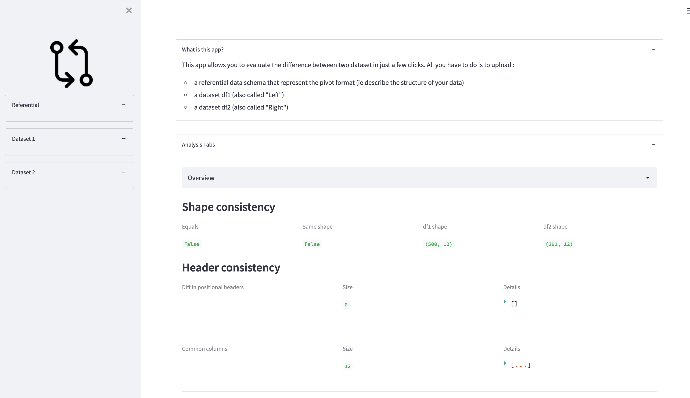

[![Contributors][contributors-shield]][contributors-url]
[![Forks][forks-shield]][forks-url]
[![Stargazers][stars-shield]][stars-url]
[![Issues][issues-shield]][issues-url]
[![MIT License][license-shield]][license-url]


<!-- PROJECT LOGO -->
<br />
<div align="center">
  <a href="https://github.com/nielsborie/streamlit-data-consistency">
    
  </a>

<h3 align="center">data consitency</h3>

  <p align="center">
    A simple toy project that lets you evaluate the consistency of your tabular data in just a few clicks.
    <br />
    <a href="https://github.com/nielsborie/streamlit-data-consistency"><strong>Explore the docs »</strong></a>
    <br />
    <br />
    <a href="https://github.com/nielsborie/streamlit-data-consistency/demo">View Demo</a>
    ·
    <a href="https://github.com/nielsborie/streamlit-data-consistency/issues">Report Bug</a>
    ·
    <a href="https://github.com/nielsborie/streamlit-data-consistency/issues">Request Feature</a>
  </p>
</div>


<!-- TABLE OF CONTENTS -->
<details>
  <summary>Table of Contents</summary>
  <ol>
    <li>
      <a href="#about-the-project">About The Project</a>
      <ul>
        <li><a href="#built-with">Built With</a></li>
      </ul>
    </li>
    <li>
      <a href="#getting-started">Getting Started</a>
      <ul>
        <li><a href="#prerequisites">Prerequisites</a></li>
        <li><a href="#installation">Installation</a></li>
      </ul>
    </li>
    <li><a href="#usage">Usage</a></li>
    <li><a href="#roadmap">Roadmap</a></li>
    <li><a href="#contributing">Contributing</a></li>
    <li><a href="#license">License</a></li>
    <li><a href="#contact">Contact</a></li>
  </ol>
</details>


## About The Project
> Have you ever struggled to compare datasets?

In many data science or data engineering projects, at one point or another you have to validate certain concepts that are crucial to the data you're exploiting. When you go into production, it's common to translate these concepts into monitoring indicators and check that you're not drifting away from what you already know (see data drift).

This project proposes a way of quickly validating the differences and similarities between two datasets, in a word, checking the consistency of the data.



<p align="right">(<a href="#readme-top">back to top</a>)</p>


### Built With
* [](https://www.python.org/downloads/release/python-3100/)
* [](https://www.python.org/downloads/release/python-360/)
* [](https://docs.docker.com/engine/install/)

<p align="right">(<a href="#readme-top">back to top</a>)</p>


<!-- GETTING STARTED -->
## Getting Started

To run and use the app, you have two options: either run it locally or use a docker container.

### Prerequisites
- Get `make`: https://www.gnu.org/software/make/
### Prerequisites #1 - run locally

- Get python: https://www.python.org/downloads/
- Get conda: https://docs.conda.io/projects/conda/en/latest/commands/install.html
- Create your environment:
  ```sh
  conda create -n streamlit-data-consistency python=3.10
  ```
- Activate your environment:
  ```sh
  conda activate streamlit-data-consistency
  ```
- Install libraries:
  ```sh
  pip install -r requirements.txt
  ```
### Prerequisites #2 - run through docker
- Install Docker following the installation guide for your platform: [here](https://docs.docker.com/engine/installation/)
- Build the docker image:
  ```sh
  make docker-build
  ```

### Installation

1. Start the app using your local environment...
   ```sh
   make run
   ```
2. Or start the app using your local environment...
   ```sh
   make run-locally
   ```
3. Visit http://localhost:8501

<p align="right">(<a href="#readme-top">back to top</a>)</p>

## Usage

You need to provide 3 files:
- a description of the data schema: `json` file representing the internal representation and data type of your data sets, a [template file](https://github.com/nielsborie/streamlit-data-consistency/blob/develop/demo/schema.template.json) can be found in `/demo` folder.
- a first dataset (supported file type are `csv` and `xlsx`)
- a second dataset (supported file type are `csv` and `xlsx`)

For the moment, it's just a simple pairwise comparison. 

Several sections are available based on the provided data type declared in the schema file :
1. Overview section:
- compare the shape, the header (columns in common, in one datasets and not in the other)...

2. Numerical section:
- for each numerical columns get the null distribution, the min/max and compute the [Jensen-Shannon divergence](https://en.wikipedia.org/wiki/Jensen%E2%80%93Shannon_divergence)...

3. Categorical tab:
- for each categorical columns get the null distribution, the count modalities and compute the [Jaccard dissimilarity](https://en.wikipedia.org/wiki/Jaccard_index)...

4. Temporal tab:
- for each temporal columns displays a Gantt Chart to visualize the span of periods within each dataset...


<p align="right">(<a href="#readme-top">back to top</a>)</p>


## Roadmap

See the [open issues](https://github.com/nielsborie/streamlit-data-consistency/issues) for a full list of proposed features (and known issues).

<p align="right">(<a href="#readme-top">back to top</a>)</p>


<!-- CONTRIBUTING -->
## Contributing

Contributions are what make the open source community such an amazing place to learn, inspire, and create. Any contributions you make are **greatly appreciated**.

If you have a suggestion that would make this better, please fork the repo and create a pull request. You can also simply open an issue with the tag "enhancement".
Don't forget to give the project a star! Thanks again!

1. Fork the Project
2. Create your Feature Branch (`git checkout -b feature/AmazingFeature`)
3. Commit your Changes (`git commit -m 'Add some AmazingFeature'`)
4. Push to the Branch (`git push origin feature/AmazingFeature`)
5. Open a Pull Request

<p align="right">(<a href="#readme-top">back to top</a>)</p>


<!-- LICENSE -->
## License

Distributed under the AGPL-3.0 License. See `LICENSE.txt` for more information.

<p align="right">(<a href="#readme-top">back to top</a>)</p>


## Contact
Project Link: [https://github.com/nielsborie/streamlit-data-consistency](https://github.com/nielsborie/streamlit-data-consistency)

<p align="right">(<a href="#readme-top">back to top</a>)</p>

<!-- https://www.markdownguide.org/basic-syntax/#reference-style-links -->
[contributors-shield]: https://img.shields.io/github/contributors/nielsborie/streamlit-data-consistency.svg?style=for-the-badge
[contributors-url]: https://github.com/nielsborie/streamlit-data-consistency/graphs/contributors
[forks-shield]: https://img.shields.io/github/forks/nielsborie/streamlit-data-consistency.svg?style=for-the-badge
[forks-url]: https://github.com/nielsborie/streamlit-data-consistency/network/members
[stars-shield]: https://img.shields.io/github/stars/nielsborie/streamlit-data-consistency.svg?style=for-the-badge
[stars-url]: https://github.com/nielsborie/streamlit-data-consistency/stargazers
[issues-shield]: https://img.shields.io/github/issues/nielsborie/streamlit-data-consistency.svg?style=for-the-badge
[issues-url]: https://github.com/nielsborie/streamlit-data-consistency/issues
[license-shield]: https://img.shields.io/github/license/nielsborie/streamlit-data-consistency.svg?style=for-the-badge
[license-url]: https://github.com/nielsborie/streamlit-data-consistency/blob/master/LICENSE.txt

[streamlit.io]: https://img.shields.io/badge/streamlit-red?color=rgb(255%2C%2075%2C%2075)&link=https%3A%2F%2Fstreamlit.io%2F
[streamlit-url]: https://streamlit.io/